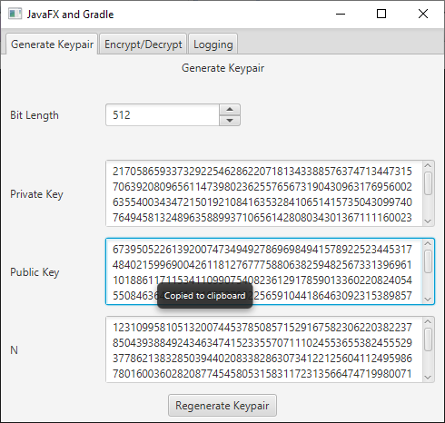
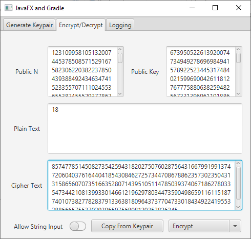
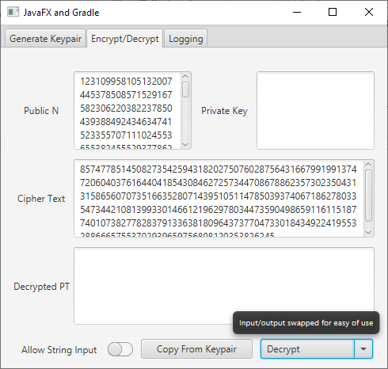
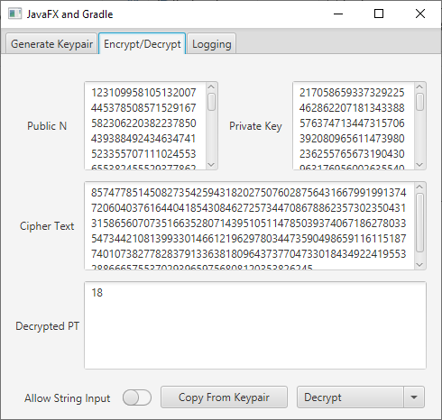
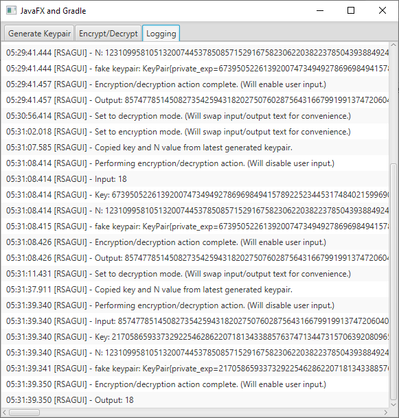

# CSE403 – CA2
> Jaideep Singh Heer
---

### Question
Write a program to encrypt message, 18, using RSA. Choose appropriate private key and public keys. Also, decrypt the message. Show your calculations and result.

### Program Description
The given program is written in Java 14.
It provides a GUI with 3 tabs.
First tab is used to generate an RSA key-pair which will be used for encryption and decryption.
Second tab allows the user to encrypt/decrypt their message by providing the relevant key parts.
The third tab is the application’s log which can be read to see how the application performs its processing.
The log is used to monitor the steps taken by the application in encrypting/decrypting and in generating RSA key-pairs.

The logic for RSA can be found in the `\source_code\src\main\java\RSA\RSACipher.java` file.
This file contains the core logic for generating the key-pairs as well as for encrypting and decrypting a message using a key-pair.

The `\source_code\src\main\java\RSAGUI` directory contains all the code required to build and present the application’s GUI as well as the entry point `main` function.
The `main` function can be found in `\source_code\src\main\java\RSAGUI\RSAGUI.java` file.

## Run The Program

No Java installation is required to run the program, it has been compiled using `jlink`.

To run the program,
 - Download the [`release-universal.zip`](https://github.com/jaideepheer/LPU-CSE403-CA2.rsaAlgorithmGUI/releases/download/latest/release-universal.zip) file from the [releases](https://github.com/jaideepheer/LPU-CSE403-CA2.rsaAlgorithmGUI/releases) page.
 - Extract the zip file to wherever you like.
 - On windows, double click the `run.bat` file.
 - On linux/MAC, run the `run.sh` file.
 
 
 If you wish to run a platform dependent build (an `.exe` for example), you can down any of the `release-<platform>.zip` files and find the executable in the `bin` folder after extracting the zip file.
 
 
## Screenshots

##### Generate Keypair

##### Encrypt

##### Change Mode

##### Decrypt

##### Log

